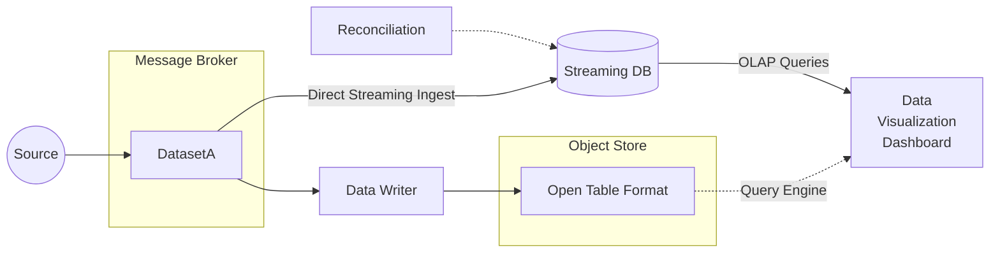

# Estimates

- VARCHAR(5000)
  - Char size = 1 to 4 byte per character
  - num char = 1 to 5000 chars
- BIGINT = uint64 = 8 byte
- Approx event message size = ~5000bytes
- 10_000 events per second = 50mb per sec
- 10 * 60 * 60 * 24 = 894,000,000 events per day = 4.32 TB per day
- 326,310,000,000 events per year = 1631.55 TB per year

From these very large estimates, the data volume and velocity is extremely high,
and we will likely need distributed systems to even have the possibility of
handling this type of scale.

# Questions to ask

- What is the dashboard being used for?
- What/when are the actions being taken after looking at the dashboard?
  - Determines latency, query types, and availability requirements
- What are the queries that are needed to visualize the dashboard?
  - How big is the aggregation window? (if any)
  - If need aggregations/windowing, consider the trade offs between aggregation with 
    event time (IoT clocks may desync / network latency) 
    or processing time (less representative)
- For "Realtime" latency requirements, is the realtime measured in milliseconds or minutes?
  - If latency is not so strict (~1 minute), we can consider simplying the stack by using just Sparks' Structured Streaming
  - Reduce the need to maintain more frameworks/systems.
  - Spark Structured Streaming can help to do streaming deduplication and write to object store/table formats like delta.
- How much historical data is needed in the dashboard for user to make well informed decisions/actions?
  - Affects how much "hot" data is needed
- Does the user require interactive queries?
  - How much historical data is needed to be available for query (different from dashboard). 
    - Affects how much to "cold" data to store / when to purge old data
- Is the data stream likely to grow over the years? How fast will it grow?
- Can we preaggregate upstream?
- What is the distribution of event frequency across different geographical locations (data skew),
  and also across the time/day (temporal skew / peak hours)
  - There is high chance there'll be peak hours for different locations, and even for different days (weekends / holidays)
  - Our system will need to account for peak traffic so it doesn't get overwhelmed at the most crucial times
- What is the distribution of item_name length (determines how big the message/data gonna be) 
- How many unique item_names are there (gauge whether dictionary compression will help ease size)
- What is the interface of the data stream?
- What is the message's serialization format? (Plain text / JSON / Protobuf / Avro / Arrow ?)
- How late will duplication occur?

## Other considerations:
- Network bandwidth across all the components
- High availability / Resilience / Uptime 
  - Depending on business needs, we may need to design to eliminate 
    single point of failure, have reliable crossover, detection of failures as they occur.
- Monitoring of timestamps as events flow through the different stages to get sensing of where
  is bottleneck in the future.
- When we have a communication between a lot of distributed systems, we need to be careful to tacle
  the problem of "exactly once" semantics in the entire system chain, and the interplay it has on latency.

# Assumptions

# Design

High level components:
  - Distributed Message Broker (eg Kafka) for async processing,.
  - OLAP Streaming Database (eg Pinot) to satisfy stream processing + high insert throughput + low latency OLAP queries
    for our visualization platform.
  - A Data Writer (eg Spark) that does regular batch jobs (~daily) to write data to long term store.
  - An Object Store (eg S3) for long term storage, with Table Format (eg Delta Lake) that sits on top of it to handle schema / version control.

## Message Broker

A message broker is introduced at the start to decouple the source event producer 
from our consuming ingestion services.

Some considerations for the message broker, specifically Kafka:
  - Since this is the point of interface, the availability of this system is very important and it should have
    better uptimes than both the producer and consumer.
  - Retention time of Topic: 1 week ~ 1 month of retention period for our situation to balance
    replayability (in case we need to re-read the topic) and storage requirements (too many events).
  - Partitioning of the Topic: Need to have high enough partition # to account for growth and for parallelism.
    Need to decide on key for partitioning, in this case likely is geographical_location_oid.
  - Delivery semantics: Consider at both producer and consumer at most once to reduce latency, 
    or least once to reduce dropped messages, depending on whether dropped messages or lower latency is more important for PM.

## Streaming Database

A streaming database is used to both remove duplicates and serve queries to the dashboard,
hence this one system serves as the stream processor and the query service for the dashboard.
This is intentional so that we only need to manage 1 system instead of 2 systems (Flink + Trino) and 
also manage how the 2 systems' interaction storage layer affects the query latency.

The streaming database will need to be able to handle high throughput insert rate, and that
queries should be able to see the freshest data (low latency, not eventual consistency).

Some considerations for the Streaming Database:
  - Need to decide on retention period for the realtime storage: Pinot is able to have a "hybrid" table 
    where it is fusion of realtime table (for fast updates) and "offline" table (for more historical data)
  - Since we are deduplicating, we will need to size the nodes' memory to handle the deduplication:
    based on our workload (~7 billion events per day * 8bytes for detection ID / # of partitions worth of data inmem). 
    Assume is just duplicated data, not updates to fields, so only need to hash the key.

### Adding a Stream Processor

If there are other use cases (ie other business needs) for a stream processor, 
it might be worth it to add the stream processor.
The stream processor can help with deduplication efforts before pushing into streaming DB. 
It can also help with pre-aggregation to ease the load on streaming DB if needed.

## Long Term Storage

The DatasetA Topic is also periodically written into a Object Store by Spark for long term storage of 
the data events. 
This can help with future data re-reprocessing should there be new use cases / updated calculations that need 
to be done on all historical data. 
In addition, this also helps keep the Message Broker lean as it doesn't have to store the entire history.

# Taking a step back

There is value in seriously considering the actual need for distributed systems.
Above assumptions take the worst case scenario in terms of data volume and size
(i.e. full fat 5000bytes unique item_name is sent for every event, with no compression at all).

If we were to reconsider a more modest estimate of each record being about 50 bytes
(4 BIGINTs + ~20 byte VARCHARs, which isn't unreasonable since average english word length is about 6 chars),
this result in ~100x smaller than original estimation.
We will then arrive at a much more palatable data volume of 43.2 GB per day and 16 TB per year. 
(This hasn't even factored in compression yet; there will likely be duplicated item names 
which compression will help with both in terms of storage and query execution.)

According to AWS/Azure/GCP VM offerings in Southeast Asia, we are able to spin up
max 12 / 11 / 4 TB RAM instances to work with our data, so a single node solution
is very possible to handle the streaming daily workload.
  - No need to handle distributed system
  - Easier to reason about
  - Easier to setup
  - Easier to maintain
  - Easier to debug
  - Easier to hire
  - Arguably cheaper as distributed systems have [overhead](https://www.usenix.org/system/files/conference/hotos15/hotos15-paper-mcsherry.pdf)
